<div align="center">


# ClaudeDeck

**Mission control for your Claude Code accounts.**

Switch between accounts, watch every quota window live, and see where your usage
is actually heading — in a real desktop app on Windows, macOS and Linux.

[](https://github.com/dev9414/claudedeck/actions/workflows/ci.yml)
[](LICENSE)
[](#install)
[](#zero-runtime-dependencies)

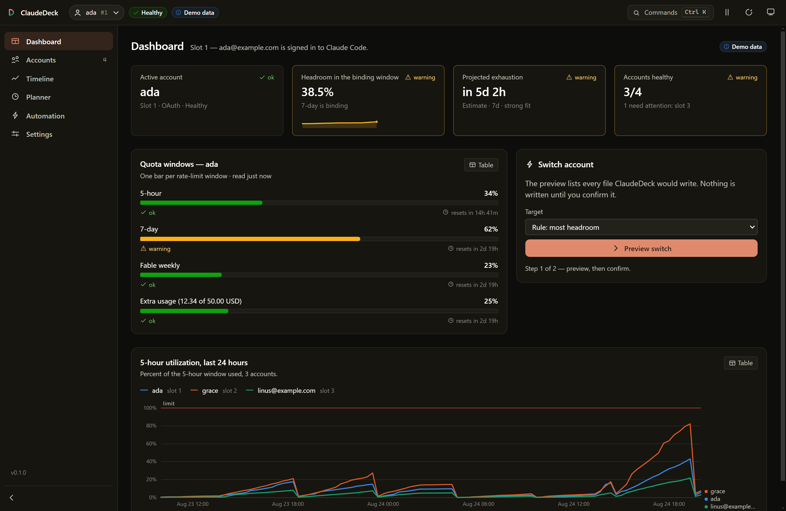

</div>

---

## What it does

If you run more than one Claude account, you already know the failure mode: you
hit a rate limit mid-task, and the only signal you had was the error message.

ClaudeDeck manages the accounts Claude Code can log in as, and makes the quota
situation legible before it bites:

- **See every account at once** — 5-hour, 7-day, per-model weekly and spend
  windows, with reset countdowns.
- **Switch without logging out** — one click, or from the tray, or from the CLI.
- **Watch the trend, not just the number** — ClaudeDeck records every poll, so
  you get usage *history* and a burn-rate projection, not a bare percentage.
- **Rotate automatically** — cross a threshold and it moves you to the account
  with the most room, before you hit the wall.

> [!IMPORTANT]
> ClaudeDeck is an unofficial community project. It is not affiliated with,
> endorsed by, or supported by Anthropic. You are responsible for using it in
> line with Anthropic's terms of service. It manages accounts *you already own
> and are logged into* — it does not create accounts, bypass limits, or
> circumvent anything.

---

## Screenshots

> Every screenshot is generated from `CLAUDEDECK_DEMO=1`, which serves four
> deterministic synthetic accounts and blocks all disk writes. No real
> credentials are involved. Regenerate them with `npm run screenshots`.

| Dashboard | Accounts |
|---|---|
| 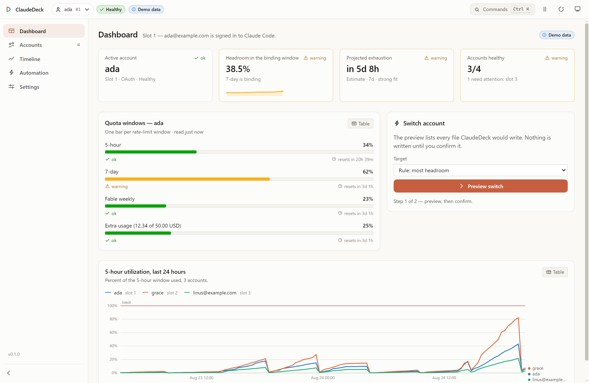 | 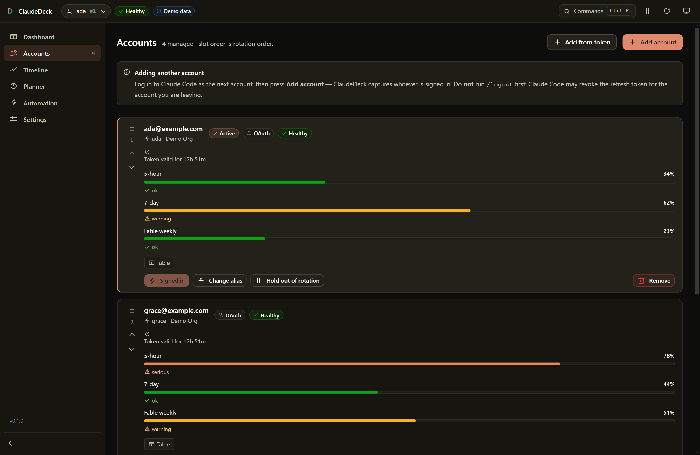 |

| Timeline | Automation |
|---|---|
| 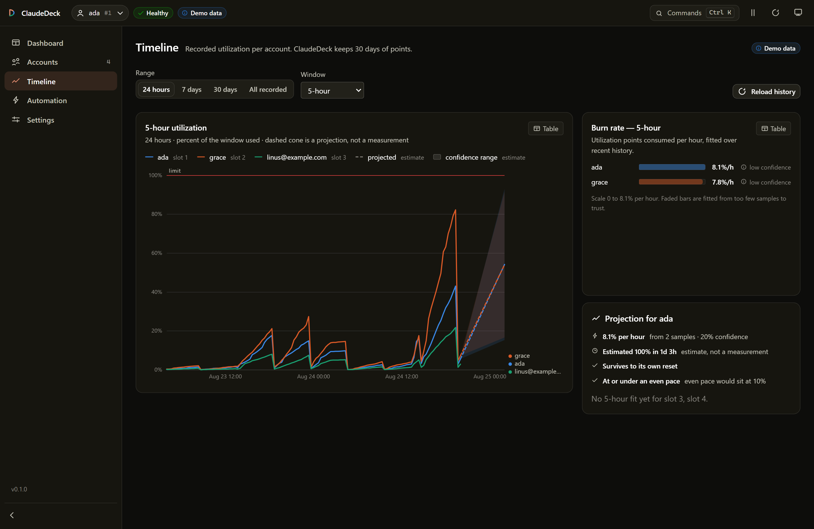 | 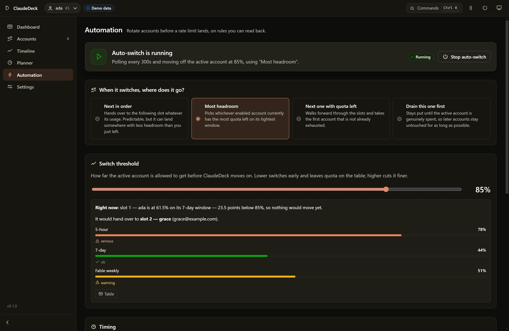 |

| Settings | Onboarding |
|---|---|
| 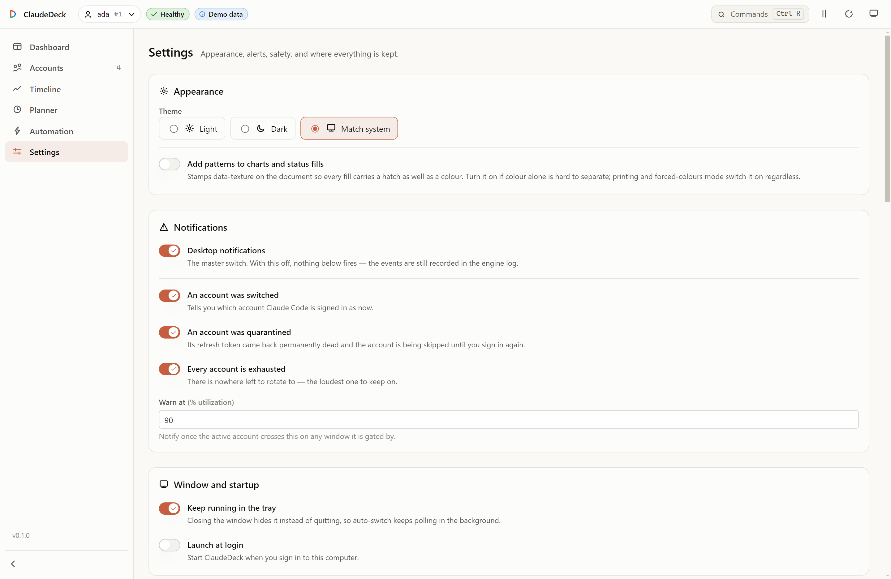 | 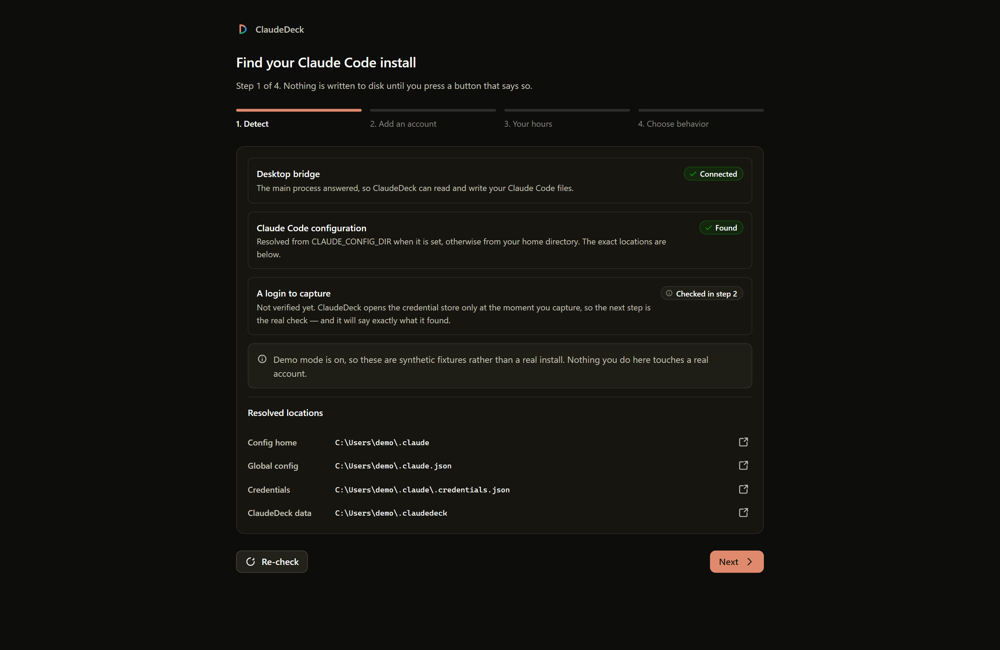 |

| Planner | Declaring your hours |
|---|---|
| 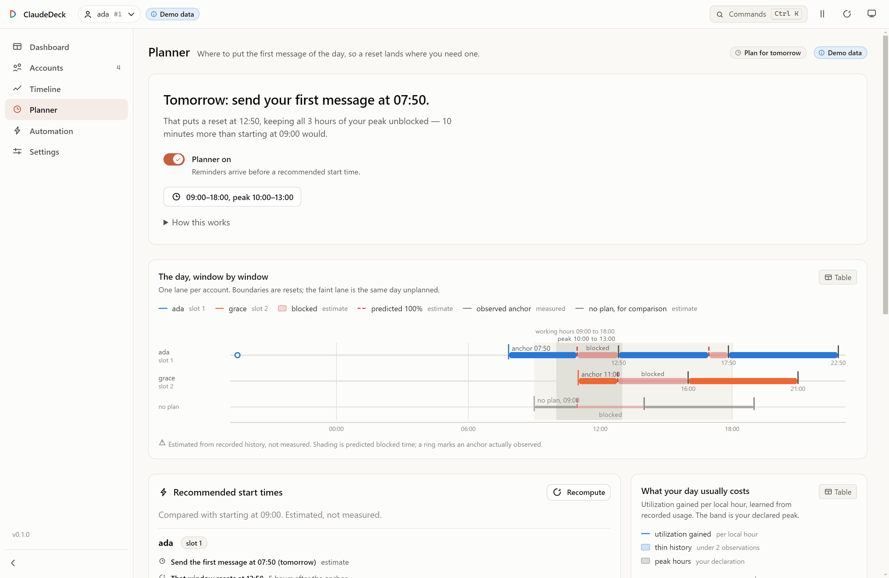 | 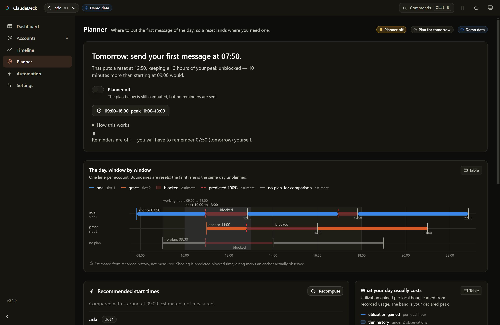 |

---

## Install

> [!NOTE]
> **There are no published installers yet.** Build from source — it takes about
> a minute. When releases do land they will not be code-signed, so Windows
> SmartScreen and macOS Gatekeeper will warn; verify against the published
> checksums or keep building from source.

### From source

```bash
git clone https://github.com/dev9414/claudedeck.git
cd claudedeck
npm install
npm run build
npm start
```

### Try it without touching your real setup

```bash
npm run demo
```

Runs against synthetic accounts with every disk write blocked. This is the right
way to evaluate it.

**Requirements:** Node 20+ to build. Claude Code installed and logged in to use
it for real.

---

## Getting started

1. **Log in to Claude Code** with your first account as you normally would.
2. **Open ClaudeDeck.** The onboarding wizard detects your install and shows you
   the resolved paths.
3. **Add the account** — ClaudeDeck captures whatever Claude Code is currently
   logged in as.
4. **Log in with your next account**, then add it too.

> [!WARNING]
> Do **not** run `/logout` before adding an account. Current Claude Code may
> revoke the refresh token for the account you are leaving, which leaves you
> with a dead slot. Just log in as the next account directly.

**Do you need to restart Claude Code after switching?** Usually not. On Windows
and Linux credentials are a file that Claude Code re-reads on change, so the
switch lands on your next message. On macOS they live in the Keychain, which
Claude Code caches for ~30 seconds. Restart only if you want it instant.

---

## The part other switchers don't do

### Usage history and burn rate

Most tooling shows you the current percentage. That tells you where you are, not
whether you are about to run out.

ClaudeDeck appends every successful poll to a local time series
(newline-delimited JSON, one file per UTC day, pruned on a retention setting).
From that it fits a least-squares burn rate and projects forward.

Two details that make the projection honest rather than decorative:

- **It segments on window resets.** A drop in utilization means the window
  rolled over, so the fit only uses the current segment. Averaging across a
  reset would produce a meaningless slope.
- **It reports its own confidence.** Two samples an hour apart is low
  confidence, and the UI renders it as an explicitly-labelled dashed estimate
  with a shaded cone — never as a confident-looking timestamp.

### Session-window planning

Your 5-hour window starts when you send your **first message**, not on the hour.
Message at 09:00 and your resets land at 14:00, 19:00; message at 11:00 and they
land at 16:00, 21:00. So when a heavy stretch would drain a window mid-flight, an
earlier anchor makes the reset arrive *during* that stretch instead of after it.

Say your peak is 11:00–14:00 and you start typing at 11:00. The window runs dry
at 13:13 and will not roll over until 16:00 — your afternoon is gone. Send one
message at 09:00 instead and you hit 100% at the same 13:13, but the reset now
lands at 14:00: 167 blocked minutes become 47.

ClaudeDeck learns which hours you actually burn quota in from its own recorded
history, simulates the day at five-minute resolution, and searches every anchor
from six hours before your day starts to the end of your peak for the one that
costs the fewest blocked minutes — counting a blocked peak minute three times
over, and staggering the anchors when you have several accounts. It places an
anchor by running the official `claude` CLI once with a two-character prompt:
this schedules when your own window starts, and raises no limit.

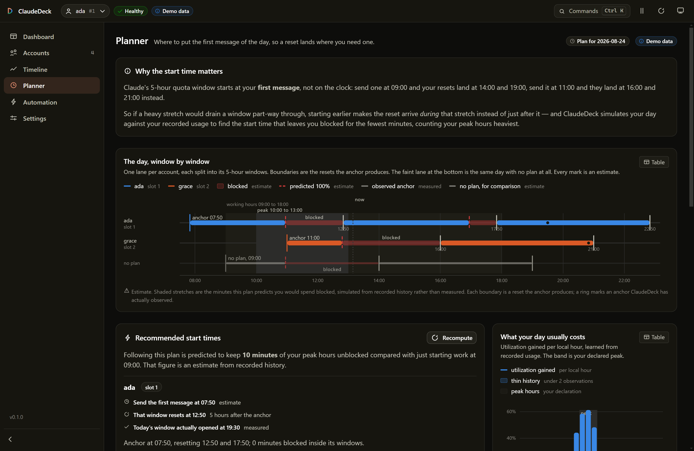

Your hours are **declared, not inferred** — ClaudeDeck learns *when you burn
quota*, but only you know *when it matters*. A burst of 3am activity might be the
one night you were firefighting. So the planner stays off until you set them, and
says plainly when it is running on defaults you never confirmed.

You are asked for them during setup, and they stay one click from the Planner:

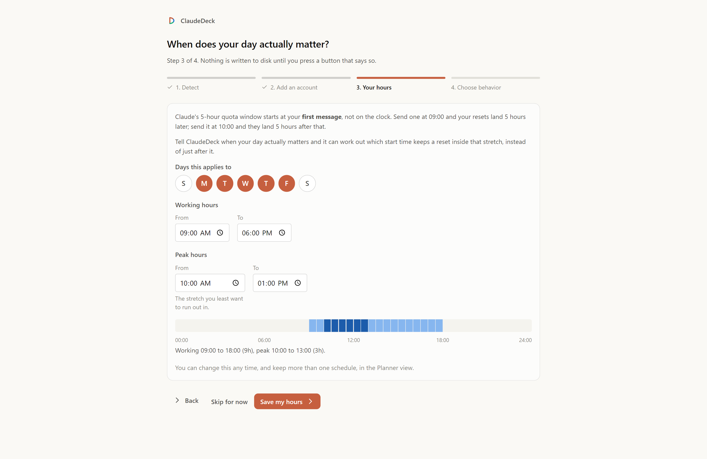

The mechanic, the maths, and an honest account of how wrong the numbers can be:
**[docs/SESSION-PLANNER.md](docs/SESSION-PLANNER.md)**.

### Preview before it writes

Switching accounts means writing to the files Claude Code authenticates with.
ClaudeDeck computes the plan first and shows you the exact paths it will touch,
and you confirm. `planSwitch()` is a pure function, so the preview and the real
switch cannot disagree.

The CLI has the same thing as `--dry-run`, and there is a global **safe mode**
that refuses every disk write in the app.

### Encrypted at rest

Account credentials go through Electron's `safeStorage` — DPAPI on Windows,
Keychain on macOS, libsecret on Linux.

Where the platform has no secure storage, ClaudeDeck **falls back to plaintext
and says so**, in the file and in the Settings UI. It never claims encryption it
doesn't have.

### A tray that works everywhere

Native system tray on Windows, macOS **and** Linux, showing each account's
binding window with a click to switch. The icon is drawn at runtime as a ring
whose fill tracks the active account's headroom, with a tooltip stating the same
thing in text.

---

## Auto-switch

Let ClaudeDeck watch and move you before you hit a limit.

| Strategy | What it actually does |
|---|---|
| `best` | Stay put until the active account nears its threshold, then move to whichever account has the most headroom. The sane default. |
| `next` | Plain rotation by slot, skipping disabled and quarantined accounts. |
| `next-available` | First account that isn't rate-limited. |
| `consume-first` | Prefer the account whose **weekly** window resets soonest — use-it-or-lose-it, so perishable quota isn't wasted. |

It's built not to thrash:

- A **cooldown** suppresses a second switch straight after the first.
- A **hysteresis margin** means a candidate must beat the incumbent by a real
  margin, so two accounts hovering either side of the threshold never ping-pong.
- **Adaptive polling** watches busy accounts closely and backs off idle ones,
  hard, after a 429 — so the request rate stays flat no matter how many accounts
  you manage.
- **Failing safe:** a usage-fetch error keeps the last-known numbers and backs
  off rather than making a decision on bad data. An account whose refresh token
  is genuinely dead gets quarantined and reported, not retried forever.
- **API-key accounts are never rotated onto** unless you opt in. They have no
  subscription quota, so treating them as "0% used" would be wrong.

---

## CLI

ClaudeDeck is not GUI-only. The same engine ships as a headless command.

```bash
claudedeck list                          # accounts with 5h/7d usage and resets
claudedeck status                        # the active account, in detail
claudedeck switch 2                      # by slot, email, or alias
claudedeck switch --strategy best --dry-run
claudedeck auto --once --threshold 85    # for cron and systemd timers
claudedeck history --slot 2 --since 7d
claudedeck forecast
claudedeck gui                           # open the desktop window
```

`--json` prints one machine-readable object on stdout with a `schemaVersion`,
and sends every human notice to stderr, so pipes stay clean:

```bash
claudedeck list --json | jq -r '.accounts[] | select(.active) | .email'
```

Exit codes for `switch` and `auto --once`: `0` switched, `1` error, `2` nothing
to do, `3` no viable target.

Full reference: **[docs/CLI.md](docs/CLI.md)**.

---

## How it compares to claude-swap

ClaudeDeck exists because of [claude-swap](https://github.com/realiti4/claude-swap),
the Python project that mapped this problem first. ClaudeDeck is a fresh
implementation in TypeScript, not a port — but the prior art deserves the credit
for working out the hard parts.

| | claude-swap | ClaudeDeck |
|---|---|---|
| Interface | CLI + terminal TUI | **Desktop GUI** + CLI |
| Tray / menu bar | macOS menu bar only | **Windows, macOS, Linux** |
| Usage view | current percentage | **recorded history + burn-rate forecast** |
| Projections | `--json` only, deliberately hidden | **charted as a labelled estimate** |
| Credentials on Windows/Linux | base64 `.enc` files, mode `0600` | **OS-encrypted** (DPAPI / libsecret), with honest fallback |
| Before a switch | switches | **previews the exact writes** |
| Parallel accounts in one terminal | ✅ session mode | ❌ not implemented |
| Maturity | in use since January, large suite | new |

**Where claude-swap is still ahead:** it has a battle-tested switching engine, a
far larger test suite, and `cswap run` — session mode, which launches Claude Code
as a specific account in one terminal so accounts work in parallel. ClaudeDeck
does not implement session mode. If that's your workflow, use claude-swap.

Detailed breakdown: **[docs/COMPARISON.md](docs/COMPARISON.md)**.

---

## Design notes

### Zero runtime dependencies

The whole app ships with no runtime `dependencies` — the charts are hand-rolled
SVG, the CLI has its own argument parser, and validation is written by hand. For
something that touches authentication tokens, every dependency is attack surface
that has to be justified, and none of these could be.

### Contract-first

[`src/shared/types.ts`](src/shared/types.ts) and
[`src/shared/ipc.ts`](src/shared/ipc.ts) are the single source of truth for the
main process, preload bridge, renderer and CLI. The preload generates its
methods from the channel list, so the bridge cannot drift from the contract.

### The core is pure

Everything in [`src/core`](src/core) takes its I/O as an injected parameter —
filesystem, `fetch`, and the clock. It imports nothing from Electron. That's why
the decision logic is testable without mocking globals, and why the CLI and GUI
run the identical engine.

### Charts are validated, not eyeballed

The categorical palette is checked by
[`scripts/validate-palette.mjs`](scripts/validate-palette.mjs), which parses the
real values out of `tokens.css` and re-runs the gates in CI:

```
light: CVD ΔE 9.2 (target ≥8) · normal-vision ΔE 19.6 (floor ≥15)
dark:  CVD ΔE 9.4 (target ≥8) · normal-vision ΔE 19.3 (floor ≥15)
```

Three light-mode slots sit below 3:1 contrast, so every chart ships direct
labels and a table view as the documented relief. Status colours always carry an
icon and a text label — colour never carries meaning on its own. There are no
dual-axis charts anywhere.

---

## Design

### The mark


A "D" whose bowl is cut into three arc segments — the product's own subject
matter, since what the app shows is a set of quota windows filling up. The stem
is the deck, the segments are the windows, and the leading segment carries the
accent because it is the one that binds first.

It is drawn on a 64 grid with a 7 stroke: the bowl is an ellipse whose vertical
radius matches the stem's cap centres, so the two join flush instead of the bowl
overshooting. It holds together at 16px and in a single colour, and the app icon
is rasterized from that same SVG by `scripts/make-icons.mjs` — one source, no
drift.

<br clear="left">

### Every icon is drawn for this app

The 34-glyph set in [`Icon.tsx`](src/renderer/components/Icon.tsx) is not Lucide,
Feather, Heroicons or anything else. Each glyph is constructed on a documented
24×24 grid: 2px stroke, ink confined to 2..22, integer endpoints except where a
point is taken off a circle, in which case it sits on an exact 45° diagonal. The
mark's vocabulary — a stem plus a segmented arc — is reused in `gauge`, `power`,
`refresh` and `pin` so the set reads as one family. See
[docs/ICONOGRAPHY.md](docs/ICONOGRAPHY.md).

### Motion that explains, not decorates

[`motion.css`](src/renderer/theme/motion.css) defines a duration scale and three
named easing curves, and every animation is built from those tokens rather than
magic numbers. Chart lines draw themselves on, meter bars grow toward a new
value, stat figures count up, the command palette staggers its rows.

Exactly two things loop: the loading shimmer and the status pulse — and the
pulse is scoped to the status glyph itself, never a whole row or card.

All of it sits behind `prefers-reduced-motion`. Under `reduce` the duration
scale collapses to near-zero, nothing loops, and the JS-driven count-up jumps
straight to its target.

---

## Security

ClaudeDeck handles OAuth tokens, so the posture is worth stating plainly:

- Tokens are **never logged, printed, or written unencrypted**. Diagnostics use
  a SHA-256 fingerprint that correlates but cannot authenticate.
- Renderer runs with `contextIsolation: true`, `sandbox: true`,
  `nodeIntegration: false`, behind a preload that exposes exactly the documented
  API and nothing else.
- Network traffic goes to **Anthropic's own OAuth and usage endpoints only**.
  No telemetry, no analytics, no third-party calls.
- **Not defended against:** a compromised OS user account. `safeStorage` binds
  to your OS login, so anything running as you can read what you can read.

Full threat model and disclosure process: **[docs/SECURITY.md](docs/SECURITY.md)**.

---

## Contributing

Issues and PRs welcome — see [CONTRIBUTING.md](CONTRIBUTING.md).

```bash
npm install
npm run dev            # hot-reloading dev build
npm test               # vitest
npm run typecheck
npm run validate:palette
```

Two rules worth knowing before you start: **no runtime dependencies**, and
**tests never touch a real `~/.claude`** — every test points the path resolver at
a temp directory.

Architecture: **[docs/ARCHITECTURE.md](docs/ARCHITECTURE.md)**.

---

## License

[MIT](LICENSE).

Prior art: [claude-swap](https://github.com/realiti4/claude-swap) by Onur
Cetinkol, also MIT. ClaudeDeck is an independent implementation; no code was
copied.
